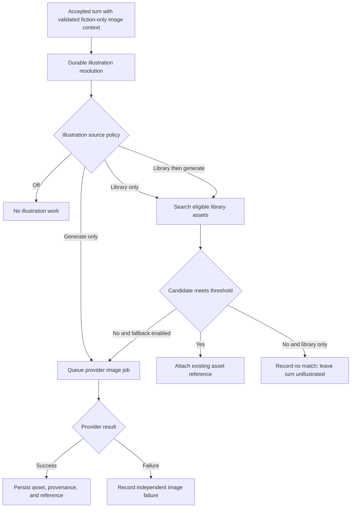

# Enhancement proposal: Context-aware image library, PhotoSwipe browser, and illustration source policies

**Status:** Phases 1-5 implemented in the current worktree. Phase 6 remains optional and deliberately gated on authentication, grants, classification provenance, and measured semantic-matching value.

The baseline implementation is anchored by migration `0031_context_aware_image_library`, the owner-scoped asset query contract, the shared `image-library-browser.js` controller, the PhotoSwipe 5 self-hosted distribution, and durable illustration-resolution jobs. Shared-library publication and matching remain unavailable until an explicit authorization model exists.

## Summary

Infinite Quest Nexus should retain every successfully generated image as an owner-scoped library asset with durable generation provenance and searchable fictional context. The web application should provide a first-class image-library browser: a filterable thumbnail grid for discovery and PhotoSwipe 5 for full-size, keyboard-, pointer-, and touch-friendly browsing, inspection, and selection. Campaigns should be able to reuse those assets automatically before spending time or provider credits on a new image.

The Campaign editor should expose one illustration source policy:

1. **No automatic illustrations**
2. **Library only**
3. **Library, then generate**
4. **Generate only**

Library matching begins only after the Story Engine has accepted a turn and validated its fiction-only `imagePrompt`. It occurs before any image provider request. A missing image, weak library match, matcher failure, unavailable image provider, or failed provider job must never change whether the story turn is accepted.

This proposal extends, but does not replace, [ADR 0008](./0008-independent-illustration-pipeline.md). Text and image providers remain independent, and library-only operation must not require an image provider or embedding provider.

PhotoSwipe is a presentation dependency, not an authority or search engine. Nexus APIs own authorization, metadata filtering, ordering, pagination, attachment, and edits. PhotoSwipe receives only the authorized result set currently loaded by the application.

## Goals

- Retain generated images for later use across supported add and edit views.
- Store enough sanitized context to find and understand an image later.
- Provide a responsive in-app browser with zoom, swipe, keyboard navigation, captions, and a direct selection action by integrating PhotoSwipe 5.
- Provide combinable, owner-scoped metadata filters with stable pagination, sort controls, removable filter chips, and facet counts where practical.
- Support automatic, best-effort matching without requiring an external provider.
- Avoid new generation when an existing image is an appropriate match.
- Permit a campaign to use library images when no image provider is configured.
- Preserve user ownership, creator provenance, future sharing boundaries, and cross-user isolation.
- Make every automatic match explainable and auditable.
- Keep provider content filtering correctly scoped to generation while adding library-specific reuse controls.
- Preserve content-addressed storage and attach existing assets without copying their bytes.

## Non-goals

- Do not match an image before story-text generation. The accepted turn supplies the validated scene context needed for a reliable match.
- Do not make illustrations part of the authoritative story-acceptance transaction.
- Do not use free-form tags as authorization controls.
- Do not expose credentials, private reasoning, mechanics, scratchpads, rejected output, or raw provider responses as image metadata.
- Do not require semantic embeddings for baseline matching.
- Do not silently publish an owner's private images to other users.
- Do not guarantee that every turn receives an image. A poor match is worse than no image.
- Do not use PhotoSwipe client filters as a substitute for server-side authorization or metadata queries.
- Do not require PhotoSwipe to edit metadata, execute asset mutations, or retain library state; those remain Nexus UI and API responsibilities.

## Current implementation boundary

The current implementation already provides useful foundations:

- `assets` stores owner-scoped, content-addressed files and deduplicates identical bytes per owner.
- `asset_references` attaches a retained asset to a campaign and turn without copying the file.
- `image_jobs` retains the validated fiction-only prompt and provider generation settings for a primary generated asset.
- Accepted turns enqueue optional image work after story and Chronicle validation.
- The library can attach a retained asset manually to supported world-cover and turn-illustration views.

The missing capabilities are first-class per-image context, intrinsic dimensions and thumbnail derivatives, creator and visibility metadata, searchable library indexes, a full-size image browser, durable match decisions, provider-independent illustration policies, and automatic match orchestration. Generation context is currently split across the asset, image job, turn, and provider-result metadata. Additional artifacts may be less directly related to their generation job than the primary asset.

The current library UI fetches at most 250 assets and renders a date-only selection grid in both the Nexus management and player views. It has no server-side metadata query contract, pagination cursor, facets, full-size browser, or reusable client component. The enhancement should replace those parallel implementations with one shared browser contract and behavior, even if the current static scripts require thin view-specific adapters.

The current campaign illustration constraint also assumes that enabling illustrations requires a provider and model. That constraint must evolve because **Library only** is valid without either.

## Illustration source policy

Use a single policy field instead of combining an enable checkbox with a separate strategy dropdown. This prevents contradictory states such as “enabled” with no usable source.

| Policy | Library search | Provider fallback | Provider required | No acceptable match |
| --- | --- | --- | --- | --- |
| `off` | No | No | No | No illustration work |
| `library_only` | Yes | No | No | Complete with no image |
| `library_then_generate` | Yes | Yes | Yes | Queue provider generation |
| `generate_only` | No | Yes | Yes | Queue provider generation |

When the configured provider becomes unavailable, Nexus should preserve the saved policy rather than silently rewriting user intent. Automatic execution for `library_then_generate` may still attempt the library, but it must record that provider fallback was unavailable if no match is found. The editor should offer an explicit switch to `library_only`.

The server must reject a newly saved provider-dependent policy when no enabled, compatible provider and model can be resolved. Browser disabling is a convenience, not the validation boundary.

## Processing model



The resolution operation should be a durable child workflow created during or immediately after turn commitment. Matching and provider generation must run outside the authoritative story mutation path. Retrying or replacing an illustration must never rerun the story turn.

## Asset ownership, creator provenance, and reuse scope

Ownership, provenance, and reuse scope are distinct concepts:

- `owner_user_id` is the current authorization boundary and already exists on `assets`.
- `created_by_user_id` records the internal user who originally generated or imported the asset.
- Generation-context records also retain their creating user because one deduplicated asset can have more than one provenance event.
- Changing ownership must not rewrite creator provenance.

During the pre-authentication phase, the server resolves both owner and creator to the database-backed `initial-owner`. The browser must not supply either value as proof of identity. Future OpenID Connect linking should continue using the same internal UUID.

Use a constrained scope field rather than a free-form `global` tag:

| Scope | Meaning |
| --- | --- |
| `private` | Visible only to the owner and excluded from automatic reuse unless explicitly selected. |
| `campaign` | Eligible for automatic reuse in its originating campaign. |
| `world` | Eligible across campaigns using the associated world, subject to version-aware matching. |
| `owner_library` | Eligible throughout the owner's personal library. |
| `shared` | Explicitly published to an authorized shared library. |

Do not call the final scope `global` unless every user is genuinely authorized to view and reuse the asset. A future sharing system should add grants, collaborators, or publication records; it must not interpret `shared` alone as sufficient authorization.

Free-form tags remain appropriate for descriptive categories such as `portrait`, `location`, `cover`, or `night`, but tags never grant access.

## Data model proposal

Exact names should be reviewed against the schema at implementation time. The intended relationships are more important than these provisional identifiers.

### Asset library fields

Extend the asset library with user-managed and policy fields, either directly on `assets` or through a one-to-one library record:

```text
asset_library_entries
  asset_id                    primary/foreign key -> assets
  owner_user_id               required ownership scope
  created_by_user_id          required internal user provenance
  title
  caption
  notes
  tags                        normalized/searchable representation
  reuse_scope                 private|campaign|world|owner_library|shared
  automatic_reuse_enabled     boolean
  review_status               unreviewed|eligible|restricted|blocked
  content_rating/categories   nullable structured classification
  favorite
  archived_at
  created_at / updated_at
```

Keep mutable curation fields separate from immutable generation provenance.

PhotoSwipe requires the intrinsic width and height of each image before display. Persist `pixel_width` and `pixel_height` on the immutable asset record or an immutable technical-metadata record, validate them when bytes are ingested, and backfill them by decoding retained files. Do not trust provider-declared dimensions without verifying the stored bytes. Consider a bounded thumbnail derivative record keyed by source asset, transform version, dimensions, and format; derivatives are rebuildable and must inherit the source asset's authorization.

### Generation contexts

Use a many-to-one relationship because content-addressed deduplication can map several generation events to identical image bytes:

```text
asset_generation_contexts
  id
  owner_user_id
  asset_id
  created_by_user_id
  image_job_id                nullable for imports or migrated content
  world_id                    nullable
  world_version_id            nullable
  campaign_id                 nullable
  turn_id                     nullable
  target_type                 world_cover|turn_illustration|other
  variant_index
  fiction_prompt
  negative_prompt             nullable
  entities                    normalized identifiers and safe display names
  characters
  locations
  factions
  scene_attributes            environment, time, weather, mood, style, objects, actions
  provider_profile_id         nullable; never contains credentials
  provider_type
  model
  generation_parameters       bounded allowlisted JSON
  parent_asset_ids            for future edit/image-to-image lineage
  metadata_schema_version
  created_at
```

Store only validated, fiction-only contextual data. Allowlist provider parameters such as width, height, aspect ratio, quality, format, seed, steps, guidance, and scheduler. Do not copy arbitrary provider request or result objects into searchable context.

### Asset usage references

Continue treating attachment as a separate relationship. An asset can be used by several worlds, campaigns, or turns without altering its provenance. Future references may need world and world-version targets in addition to the existing campaign/turn roles.

### Illustration resolution jobs

Do not overload provider-bound `image_jobs` with library matching. Introduce a durable parent operation:

```text
illustration_resolution_jobs
  id
  owner_user_id
  campaign_id
  turn_id
  source_policy
  matching_scope
  confidence_profile
  query_context_snapshot
  status                      queued|matching|matched|no_match|generation_queued|completed|recoverable|failed
  selected_asset_id           nullable
  selected_score              nullable
  matching_algorithm_version
  image_job_id                nullable child provider job
  reason_code
  created_at / updated_at / completed_at

illustration_match_candidates
  resolution_job_id
  asset_id
  rank
  score
  score_components
  rejection_reasons
```

Candidate retention may be limited to the top bounded set to control storage. Persist enough evidence to explain the decision without retaining private story-engine context.

## Context extraction

The match query should be constructed from the accepted, sanitized turn:

- The validated `imagePrompt`
- Present canonical character/entity identifiers
- Current location and world-version identifiers
- Safe scene attributes derived from accepted fiction
- Optional visible action, environment, time, weather, mood, style, and objects

Prefer canonical identifiers over names when available. Names remain useful for imported or older assets but can collide across worlds.

Do not include player mechanics, roll results as mechanics, stats, targets, hidden trackers, scratchpads, trigger diagnostics, model reasoning, rejected narration, or raw provider responses. A sanitized diegetic consequence may be included only when it is already part of accepted fiction.

## Matching strategy

The baseline matcher must work locally without image or embedding providers. It should combine structured filtering, full-text ranking, and deterministic scoring. Semantic similarity may enhance the score when compatible embeddings already exist, but the same policy must still function when embeddings are disabled or unhealthy.

### Candidate eligibility

Before scoring, require all of the following:

- The asset is authorized for the server-resolved user.
- The asset is within the configured matching scope.
- Automatic reuse is enabled.
- The asset is not archived or blocked.
- Its content review status satisfies the campaign policy.
- Its file is present and is a supported raster type.
- World, campaign, and version restrictions do not conflict.

Imported or user-uploaded assets should default to `unreviewed`. They may be selected manually, but should not enter automatic matching until explicitly approved or allowed by policy.

### Score components

The first implementation should favor precision over recall:

| Signal | Influence |
| --- | --- |
| Canonical character/entity agreement | Very high |
| Canonical location agreement | Very high |
| Conflicting character, location, time, or scene type | Hard rejection or large penalty |
| World and world-version relationship | High |
| Fiction-prompt text similarity | High |
| Structured action/object overlap | Medium to high |
| Style, environment, weather, time, and mood | Medium |
| Semantic similarity when available | High but bounded |
| Aspect-ratio compatibility | Low to medium |
| Reuse in nearby turns | Negative |

“Best available” must never mean “always attach something.” Apply an absolute confidence threshold and contradiction rules after ranking. If no candidate passes, return `no_match`.

### Confidence profiles

Expose understandable profiles rather than a raw score in the initial UI:

- **Strict:** highest precision; recommended for cross-campaign or owner-library matching.
- **Balanced:** default within the current world.
- **Broad:** accepts looser contextual similarity but still honors hard contradictions.

The server maps each profile to versioned scoring weights and thresholds. Persist the resolved threshold and algorithm version on the resolution job so later algorithm changes do not obscure earlier decisions.

### Matching scope

Offer these scopes independently of asset visibility:

- Current campaign
- Current world — recommended default
- Entire authorized personal library
- Authorized shared library, when sharing exists

Automatic matching should be more conservative than manual browsing. Entire-library and shared-library searches should use stricter thresholds and stronger canonical-entity requirements.

### Repetition control

Penalize assets used within a configurable recent-turn window. A reasonable initial default is to avoid automatically repeating the same image within the previous five illustrated turns unless it is the only candidate above a deliberately higher repeat threshold.

## Content filtering and safety

Provider content filtering and library eligibility are separate controls:

- Provider filtering applies only when Nexus requests a new image.
- Reattaching a retained image makes no provider call, so the provider filter cannot evaluate it.
- Generated asset provenance should record the requested provider filtering mode and any allowlisted classification result the provider actually returns.
- Library assets require an independent review status and automatic-reuse eligibility.
- Provider filtering metadata is evidence, not an authorization mechanism.

Automatic matching should default to eligible generated assets and explicitly approved imports. Unknown or unreviewed content should remain manually selectable only, unless an administrator deliberately changes the policy.

Never store credentials, signed temporary URLs, raw provider payloads, private reasoning, mechanics, scratchpads, rejected output, or hidden story state in library metadata. Continue rejecting unsafe remote-only artifacts according to the independent illustration pipeline.

## Campaign editor experience

Replace **Generate an optional illustration after each accepted turn** with **Automatic illustration source** and the four policies described above.

Show controls progressively:

- `off`: hide matching and provider settings.
- `library_only`: show matching scope, confidence, repetition, and eligibility settings; hide provider settings.
- `library_then_generate`: show both matching and provider-generation settings.
- `generate_only`: show provider-generation settings; hide automatic matching settings.

Provider-dependent options are disabled when no enabled compatible provider exists. **Library only** remains selectable regardless of provider availability and remains valid even when the owner's library is empty; turns then complete without an image until a match becomes possible.

Display a concise status summary such as:

- “Library only; current world; Balanced matching.”
- “Try the library first, then generate with Sogni profile X and model Y.”
- “Fallback generation is unavailable because the selected provider is disabled.”

Do not silently downgrade or rewrite the stored policy when a provider is temporarily unavailable.

## Image library experience

The image library should be one reusable experience with two coordinated layers:

1. A Nexus-owned discovery surface containing the query, metadata filters, sort controls, result count, active-filter chips, thumbnail grid, pagination, selection state, and metadata editor.
2. A PhotoSwipe 5 detail surface for browsing the currently authorized and filtered result sequence at full size.

Opening a thumbnail should enter PhotoSwipe at that asset. A picker invocation should expose a clear **Use this image** action in the PhotoSwipe UI as well as a grid-level selection action. A browse-only invocation should omit the selection control. Closing PhotoSwipe returns focus to the originating thumbnail without losing the query, scroll position, loaded pages, or selection context.

Each grid item should show its title or accessible fallback, origin, creation date, creator when authorized, usage count, primary context, reuse scope, and content/review state. Detailed provenance can show prompt and allowlisted generation settings without exposing secrets or private orchestration. Supported add and edit views select an asset by reference and never duplicate stored bytes. Initial reuse targets are world covers and turn illustrations; later targets should use the same browser invocation contract.

### Metadata filters and query behavior

Custom filtering belongs to the Nexus query API and discovery UI. PhotoSwipe should browse the resulting ordered collection; its extension API may render the active filter summary or library actions, but it must not decide which assets the user is authorized to receive.

The library should support combinable filters for:

- Created by me
- Owned by me
- Current campaign
- Current world or world version
- Entire personal library
- Shared with me or explicitly published, when sharing exists
- Generated, imported, or user-uploaded origin
- Character, entity, location, tag, model, provider, date, and content status
- Eligible or excluded from automatic reuse
- Favorite, archived state, reuse scope, review status, MIME type, and broad aspect-ratio class

The first filter release should prioritize useful metadata that can be indexed reliably: text query, scope, campaign, world, world version, origin, tags, canonical characters/entities, canonical location, provider, model, date range, review status, automatic-reuse eligibility, favorite, and archived state. Content categories and shared-library filters can remain hidden until their data and authorization models exist.

Use explicit query semantics:

- Multiple values within one facet use documented `any` behavior by default; separate `allTags` behavior may be added for tags.
- Different facets combine with `and` semantics.
- Unknown metadata is not silently treated as a match; the UI may offer an explicit **Unknown** value where useful.
- Sort options are constrained and stable, initially newest, oldest, title, and most used, with asset ID as the final tie-breaker.
- Cursor pagination carries the normalized filter and sort definition or rejects a cursor reused with a different query.
- The API returns only authorized facet counts. Facets must not reveal the existence of excluded assets.
- URL state may preserve non-sensitive filters and sort order in the management view, but must not include private prompts or unrestricted metadata.

Filter changes should be debounced, cancel stale requests, reset pagination, update the result count and active-filter chips, and announce the result change through an accessible live region. Provide **Clear all** and individual chip removal. Empty and no-match states should distinguish an empty library from filters that exclude all authorized images.

### PhotoSwipe 5 integration

Use the PhotoSwipe 5 Lightbox module and dynamically import its Core module when the browser is first opened. Install and pin the compatible `photoswipe@5` package through pnpm, self-host its JavaScript and CSS in the application image, and do not depend on a public CDN or expose `node_modules` as a static directory. The implementation phase must add a documented build or copy step for the browser assets and preserve the repository's reproducible container build.

Build PhotoSwipe item data from the API response rather than scraping presentation text from the DOM. Each item needs at least:

```text
id
src                       authorized full-size asset URL
width / height            verified intrinsic dimensions
msrc or thumbnailSrc      authorized bounded thumbnail URL
alt                       safe accessible description
title / caption           safe plain-text display fields
metadata summary          bounded fields for custom UI
```

Use PhotoSwipe's array data source for the currently loaded ordered result set. The grid may load additional cursor pages; when the viewer approaches the end of loaded items, it may prefetch the next page and extend the in-memory data source without changing the frozen filter/sort definition for that open session. If reliable extension proves brittle, close and reopen on the enlarged result set rather than presenting an incorrect index or duplicate slide. A changed filter starts a new browser result session.

Register a custom caption or metadata panel through PhotoSwipe's supported UI/event APIs. Render text with DOM text nodes, never untrusted `innerHTML`. The panel should show title, caption, tags, primary world/campaign context, origin, dimensions, creator when authorized, created date, review/reuse state, and a concise provenance link or action. Keep long prompts and advanced metadata in a separate Nexus details view so the image remains usable on small screens.

Picker mode should register **Use this image** as a custom PhotoSwipe button that calls the same validated selection callback as the grid. Other useful actions are **View details**, **Favorite**, and **Edit metadata** when allowed, but these remain Nexus API mutations and should be added only with loading, error, and optimistic-concurrency handling. Never place delete, publish, ownership transfer, or moderation actions in the first PhotoSwipe integration.

Preserve progressive enhancement and accessibility:

- Grid thumbnails remain links or buttons with useful labels and a direct full-image fallback.
- Captions and alternative text remain available outside PhotoSwipe.
- Keyboard focus, Escape-to-close, arrow navigation, reduced-motion preferences, screen-reader announcements, and touch gestures are tested.
- Animated GIF behavior, failed image loads, unsupported formats, and missing dimensions have explicit fallbacks.
- Serve responsive full-size variants where practical and avoid sending unnecessarily large originals; PhotoSwipe documentation recommends responsive images and cautions against very large source images.

PhotoSwipe is not a metadata-filtering library. Its `itemData`, `numItems`, `thumbEl`, `placeholderSrc`, events, and custom UI hooks are integration points for displaying Nexus results, not a reason to move database filtering into the browser.

## Turn-level controls

The campaign policy controls automatic behavior, but a completed turn should still offer explicit actions:

- Choose from library
- Find another library match
- Generate a new image, when a provider is available
- Remove the current illustration
- Exclude this image from future automatic matches
- Inspect **Why this image?** with bounded match evidence

Avoid an ambiguous **Regenerate** label. Finding another retained match and spending provider resources to generate a new image are different operations.

Manual replacement should attach the newly chosen asset first and then update the active reference transactionally. It must not delete the previously retained asset. Manual selection can include authorized assets that automatic matching excludes, with appropriate content warnings.

## API and contract outline

Shared contracts should define constrained enums and responses rather than accepting arbitrary metadata. Likely endpoints include:

```text
GET/PUT  /api/v1/campaigns/:campaignId/illustration-config
GET      /api/v1/assets?q=&scope=&creator=&worldId=&worldVersionId=&campaignId=&origin=&tags=&entityIds=&locationIds=&provider=&model=&reviewStatus=&reuseScope=&eligible=&favorite=&archived=&mimeType=&aspect=&createdFrom=&createdTo=&sort=&cursor=&limit=
GET      /api/v1/assets/facets?...
GET/PATCH /api/v1/assets/:assetId/library-metadata
GET      /api/v1/turns/:turnId/illustration-resolution
POST     /api/v1/turns/:turnId/illustration-match
PUT      /api/v1/turns/:turnId/illustration-asset
POST     /api/v1/turns/:turnId/illustrations
```

The exact route split should be reviewed to avoid duplicating existing library and illustration endpoints. Every query and mutation must derive the user from server identity, enforce ownership or sharing grants, and validate world/campaign relationships.

The asset-list contract should return a stable cursor, total count when it can be computed within the agreed performance budget, authorized facet counts, verified dimensions, thumbnail and full-size URLs, accessible display text, and the bounded metadata needed by the grid and PhotoSwipe. Do not expose filesystem paths, provider credentials, raw provider payloads, or signed upstream URLs. Cache validators must account for metadata edits as well as immutable image bytes.

Match APIs should return bounded explanations, not private ranking internals or unrestricted context snapshots. Manual match requests must be idempotent or use an explicit replacement revision.

## Indexing and performance

- Add owner-first indexes for library scope, reuse eligibility, review status, world, campaign, creator, and creation date.
- Add indexes that support the shipped filter combinations and stable cursor sorts; confirm them with representative `EXPLAIN (ANALYZE, BUFFERS)` plans before widening the default page size.
- Normalize canonical entity/location relationships into indexed rows when practical rather than relying exclusively on JSON containment.
- Use PostgreSQL full-text search for the provider-independent baseline.
- Reuse compatible stored embeddings only as a derived index. Embeddings may be rebuilt and must never become required provenance.
- Bound candidate pools before detailed scoring.
- Avoid holding the story-commit transaction open while matching.
- Record matching latency and candidate counts without logging private story content.

## Deduplication and provenance

The existing uniqueness of `(owner_user_id, content_hash)` means identical bytes resolve to one asset. Do not weaken that storage guarantee merely to retain multiple contexts.

Instead:

- Create one generation-context row per successfully persisted artifact and generation occurrence.
- Preserve every job/variant relationship, including non-primary variants.
- Attach one asset to many usage references.
- Choose a primary display context without deleting other provenance.
- Treat transfer of ownership as a separate audited operation that does not rewrite creator fields.

## Backfill and migration

Implement forward capture first so every newly generated artifact receives complete metadata. Then perform an optional bounded backfill:

1. Create library entries for existing assets with `owner_user_id` as both owner and provisional creator.
2. Recover primary generation provenance from `image_jobs.asset_id`, prompts, provider profiles, and generation settings.
3. Recover additional artifact relationships only from validated, known metadata shapes.
4. Derive usage scope from existing world, campaign, turn, and asset-reference relationships.
5. Mark uncertain origin or content classification as `unreviewed`; do not invent metadata.
6. Make the backfill idempotent and resumable.

Do not parse arbitrary historical provider payloads into public metadata. Unknown fields remain private operational history or are ignored.

## Failure and recovery semantics

- A matcher error becomes an independent recoverable resolution failure and cannot affect the accepted turn.
- `library_only` never calls an image provider, including during retry.
- `library_then_generate` calls the provider only after a completed no-match decision.
- An unavailable fallback provider records a specific outcome rather than converting the policy silently.
- Provider retries remain governed by the existing independent image-job policy.
- Re-running resolution must be idempotent and must not create duplicate active references or duplicate provider jobs.
- Rewind, branch, import replacement, transfer, and deletion workflows must account for active resolution jobs as well as active image jobs.
- Removing a reference does not delete the retained asset unless a separate, reviewed asset-deletion operation proves it has no protected uses.

## Observability and cost attribution

Structured logs and activity events should include correlation IDs plus:

- Resolution job, campaign, turn, and selected asset identifiers
- Policy, matching scope, confidence profile, and algorithm version
- Candidate count, selected score, decision reason, and duration
- Whether provider generation was avoided, queued, unavailable, or failed
- Child image-job identifier when present

Do not log prompts, private context snapshots, credentials, or unnecessary story text.

Library reuse incurs no image-provider charge. Cost attribution remains attached only to actual provider operations. Product metrics may separately count avoided generations, but should label them as estimates rather than realized savings unless a reliable provider cost basis exists.

## Security and privacy review

- All asset, context, candidate, reference, and resolution records remain owner-scoped or explicitly grant-scoped.
- `created_by_user_id` is internal provenance and should not be exposed in portable exports or public views by default.
- Shared publication requires an explicit auditable action and future authorization design.
- Search results must not reveal that an unauthorized asset exists.
- Imported metadata and tags are untrusted and require schema validation and safe rendering.
- Deleting or anonymizing a user may require a defined provenance-retention policy before multi-user authentication ships.
- Image files should not be mutated merely to embed internal user UUIDs. Database metadata is the authoritative ownership and provenance record.

## Phased implementation plan

Each phase should be independently deployable, preserve accepted-turn behavior, include migrations and rollback notes, and update tests associated with every changed file. Later phases may refine earlier contracts but must not require a big-bang release.

### Phase 1: Asset metadata foundation

**Outcome:** every new retained image has the safe technical, curation, and provenance data needed by the browser and future matcher.

- Add library curation, creator, reuse scope, generation-context, verified pixel dimensions, and derivative metadata.
- Decode stored bytes to verify MIME type and dimensions during ingestion; generate bounded thumbnails asynchronously or during persistence without blocking story acceptance.
- Capture complete immutable provenance for every generated variant while keeping mutable title, caption, notes, tags, favorite, review, and reuse fields separate.
- Add optimistic-concurrency behavior for mutable metadata.
- Backfill existing assets idempotently, marking uncertain fields `unreviewed` or unknown rather than inventing values.
- Add owner-first indexes and authorization tests before exposing new fields.

**Exit criteria:** newly created and backfilled assets can produce a safe browser item with full-size URL, thumbnail URL or fallback, verified dimensions, accessible text, and bounded metadata.

### Phase 2: Filtered library API

**Outcome:** Nexus can query an authorized image library efficiently and consistently without loading all assets into the browser.

- Replace the fixed `limit=250` behavior with cursor pagination, stable constrained sorts, normalized filter contracts, and bounded page sizes.
- Implement the initial indexed facets: text, scope, campaign, world/version, origin, tags, canonical entity/location, provider/model, date, review state, reuse eligibility, favorite, and archive state.
- Return authorized facet counts and total count only within a measured query budget; otherwise return a documented approximate or omitted total.
- Add metadata read/update endpoints with schema validation and concurrency checks.
- Prove cross-user isolation and ensure counts, cursors, errors, and timing do not reveal unauthorized assets.
- Record representative query plans and pagination behavior in integration tests.

**Exit criteria:** API and contract tests demonstrate stable, owner-scoped paging and correct `and`/`any` filter semantics on a realistically sized fixture set.

### Phase 3: Shared grid and PhotoSwipe 5 browser

**Outcome:** World Library and Infinite Quest use one filterable, accessible image-browser behavior for browsing and manual selection.

- Add pinned `photoswipe@5` assets to the reproducible application build, self-host the CSS and modules, and dynamically load Core on first open.
- Replace the duplicate date-only grids with a shared browser controller plus thin management/player adapters.
- Add search, custom metadata filters, facet controls, active-filter chips, sorting, empty states, cursor-based load-more/infinite scroll, and restoration of query/scroll state.
- Open the filtered result set in PhotoSwipe with verified dimensions, thumbnails, responsive sources where available, accessible captions, metadata summary, counter, and focus restoration.
- Add browse mode and picker mode. Picker mode provides a **Use this image** action that attaches the asset by reference through the existing validated API.
- Keep filters and mutations Nexus-owned; freeze query/sort during an open PhotoSwipe session and prefetch bounded next pages near the end.
- Test keyboard, screen reader, touch, reduced motion, narrow viewport, failed image, and direct-image fallback behavior.

**Exit criteria:** users can filter, inspect, zoom, swipe, and select authorized images from both initial target views without losing state or duplicating asset bytes.

### Phase 4: Provider-independent matching and library-only policy

**Outcome:** campaigns can illustrate accepted turns entirely from retained assets, with no image or embedding provider.

- Add durable resolution jobs, current-campaign/current-world matching scopes, structured filtering, full-text scoring, thresholds, contradiction rules, and bounded explanations.
- Ship `off` and `library_only` policies first; keep automatic reuse more conservative than manual browser selection.
- Add **Find another library match**, **Why this image?**, and exclusion-from-automatic-reuse controls to the browser/detail flow.
- Measure false matches and rematch/exclusion behavior against sanitized fixtures before enabling automatic provider fallback.

**Exit criteria:** library-only campaigns deterministically attach only above-threshold assets, survive restarts and retries, and complete accepted turns normally when no match exists.

### Phase 5: Library-first fallback generation

**Outcome:** campaigns can reuse first and generate exactly once only when reuse has produced a durable no-match decision.

- Add `library_then_generate` and `generate_only` policies and progressive campaign-editor controls.
- Connect durable no-match decisions to the existing provider image jobs with idempotency and provider-availability outcomes.
- Add repetition control, manual rematch, and distinct **Generate a new image** behavior.
- Surface newly generated assets in the active library/browser result when they satisfy the frozen filter, without corrupting the current PhotoSwipe index.
- Verify cost attribution, retry, rewind, branch, deletion, and failure behavior.

**Exit criteria:** an accepted turn never waits on illustration success, and fallback generation is neither skipped nor duplicated across retries.

### Phase 6: Semantic, sharing, and advanced browser enhancements

**Outcome:** optional quality and collaboration features extend the stable owner-scoped baseline.

The background, prerequisites, detailed workstreams, guardrails, and completion criteria are retained in [Image Library Phase 6 future enhancement](./image-library-phase-6-future-enhancement.md). This phase is not scheduled or approved merely by appearing in this plan.

- Add optional semantic scoring using compatible derived embeddings without weakening hard contradictions or authorization.
- Add authorized shared-library publication, grants, shared facets, and creator display only after authentication and collaboration rules exist.
- Add advanced content-category filters only after classification provenance and moderation rules are defined.
- Consider saved filter views, bulk curation, comparison mode, and richer PhotoSwipe metadata actions based on measured use rather than making them Phase 3 dependencies.
- Tune scoring from sanitized evaluation fixtures and observed opt-out/rematch behavior.

**Exit criteria:** optional capabilities can be disabled without breaking the Phase 1-5 library, browser, or illustration workflows.

## Required tests

### Contracts and persistence

- Every generated artifact, including secondary variants, retains immutable generation context.
- Identical bytes deduplicate while preserving multiple provenance events.
- Ownership transfer preserves creator provenance.
- Caller-supplied owner or creator identifiers cannot spoof identity.
- Cross-user asset discovery, matching, and attachment are rejected without an explicit grant.
- Pre-authentication creation resolves owner and creator to `initial-owner` idempotently.
- Backfill is idempotent and does not invent unavailable metadata.
- Stored dimensions are decoded from retained bytes, and thumbnail derivatives inherit source authorization.
- Metadata updates enforce schema validation and optimistic concurrency.
- Asset cursors cannot be reused with a different normalized filter or sort definition.
- Facet counts and pagination never include unauthorized assets.

### Library queries and browser

- Filter facets implement the documented `and`, `any`, unknown-value, and date-boundary semantics.
- Stable sorting and tie-breaking prevent duplicates or omissions while paging through an unchanged result set.
- A stale response cannot replace results from a newer filter request.
- Active-filter chips, individual removal, **Clear all**, result count, empty states, and accessible announcements stay synchronized.
- PhotoSwipe opens at the selected grid item and receives only the current authorized filtered result sequence.
- Approaching the loaded boundary prefetches or falls back without duplicate slides, incorrect counters, or silently changing filters.
- Captions and metadata are rendered as safe text; imported markup cannot execute.
- Closing restores focus, scroll, filters, sort, and picker context.
- Picker and browse modes expose the correct controls, and **Use this image** uses the same validated reference API as grid selection.
- Keyboard, touch, reduced-motion, narrow-viewport, failed-load, missing-dimension, and progressive fallback behavior are covered.

### Policy behavior

- `off` creates no resolution or provider work.
- `library_only` works without image or embedding providers.
- `library_only` attaches an above-threshold match and leaves no image below threshold.
- `library_then_generate` queues exactly one provider job after a durable no-match result.
- `library_then_generate` never generates when an acceptable match exists.
- `generate_only` skips library matching.
- Provider-dependent policies are rejected when newly saved without a valid provider/model.
- Temporary provider loss does not rewrite the saved campaign policy.

### Matching

- Owner, scope, review, archive, and automatic-reuse filters run before scoring.
- Exact canonical entity/location matches rank above loose text similarity.
- Contradictory characters or locations reject otherwise similar images.
- Current-world defaults do not leak candidates from unrelated worlds.
- Low-confidence searches return no match.
- Repetition penalties prevent nearby duplicate use according to policy.
- The baseline matcher behaves deterministically without embeddings.
- Semantic enhancement cannot bypass authorization or hard contradictions.
- Persisted explanations identify the versioned decision without exposing private context.

### Safety and integrity

- Mechanics, rolls, hidden trackers, scratchpads, rejected output, and reasoning never enter image context or search text.
- Provider content-filter settings apply only to new generation.
- Blocked and unreviewed assets are excluded from automatic reuse according to policy.
- Illustration matching and generation failures do not mutate or reject accepted turns.
- Manual replacement retains the previous asset and updates references atomically.
- Rewind, branching, transfer, import replacement, and deletion handle active resolution jobs safely.

### UI and end to end

- **Library only** remains enabled with no image provider.
- Provider-dependent choices accurately reflect provider availability.
- Progressive settings visibility matches the selected policy.
- Library filters distinguish owner, creator, campaign, world, and shared scopes.
- A turn explains whether its image was reused or newly generated.
- Manual **Find another library match** and **Generate a new image** remain distinct.
- Accessible status text communicates no-match and unavailable-fallback outcomes without relying on color.
- The metadata-filtered grid and PhotoSwipe browser behave consistently in World Library and Infinite Quest picker entry points.
- Generated images appear in the library after completion without destabilizing an already open filtered browser session.

## Acceptance criteria

This enhancement is complete when:

- Newly generated images are durably retained with safe, searchable, versioned provenance.
- Ownership, creator provenance, reuse scope, and descriptive tags are modeled independently.
- Campaigns can run in library-only mode with no image or embedding provider.
- Library matching happens after accepted fiction exists and before provider generation.
- No image is attached below the configured confidence threshold.
- Library-first mode falls back exactly once when appropriate and never blocks story completion.
- Every reuse decision is owner-scoped, explainable, recoverable, and idempotent.
- Manual library reuse works across the intended add and edit views without duplicating asset bytes.
- Users can search and combine supported metadata filters with stable, owner-scoped pagination and understandable active-filter state.
- PhotoSwipe 5 provides full-size browse, zoom, swipe, keyboard navigation, accessible captions, and picker selection over the current authorized result set.
- Browser state survives opening and closing PhotoSwipe, and an unsupported or failed lightbox still leaves a usable direct-image path.
- Provider and library safety policies are both enforced at their correct boundaries.
- Tests cover identity isolation, deduplication, matching quality, workflow recovery, and provider-independent behavior.

## Recorded baseline decisions and deferred questions

The implemented baseline records these decisions:

- Mutable curation lives in `asset_library_entries`; immutable bytes and technical identity remain in `assets`.
- Generation context stores bounded entity, character, and location JSON alongside owner, world, version, campaign, turn, provider, and model provenance.
- Campaign and world affinity contribute deterministic score components; the selected matching scope remains an eligibility boundary.
- Strict, Balanced, and Broad thresholds begin at `0.68`, `0.52`, and `0.38`. These values must be recalibrated from sanitized production-like fixtures before broad matching is made the default.
- Matching defaults to world scope with a five-turn repetition window.
- Imported and backfilled images remain `unreviewed` and ineligible for automatic reuse until explicitly curated.
- Match-candidate evidence is bounded to the ten highest-ranked candidates per durable resolution job.
- Rebuildable 480-pixel WebP thumbnails use the existing content-addressed asset store and an explicit transform version.
- Facet totals are exact for the currently authorized, filtered result set and page sizes remain bounded.
- The browser uses a checked-in shared ES module and self-hosts the pinned PhotoSwipe distribution through an allowlisted server route; no public CDN or general `node_modules` static exposure is used.
- Management filters remain in component state for this baseline; sensitive prompt/context fields are never placed in URLs.

The following remain Phase 6 or separate migration decisions: creator display after ownership transfer or publication, evidence-retention policy, portable binary export/import, authorization and moderation for shared scope, responsive full-size derivatives and maximum served dimensions, estimated facets at substantially larger scale, and safe URL persistence or saved filter views.

## PhotoSwipe references

- [Getting Started](https://photoswipe.com/getting-started/) — Lightbox/Core split, dynamic import, required dimensions, responsive images, progressive fallback, and supported browsers.
- [Data Sources](https://photoswipe.com/data-sources/) — array and dynamic data sources, separate DOM/data handling, and thumbnail/placeholder integration.
- [Filters](https://photoswipe.com/filters/) and [Events](https://photoswipe.com/events/) — supported hooks for item data and lifecycle integration. These are PhotoSwipe extension hooks, not Nexus metadata-query filters.
- [Caption](https://photoswipe.com/caption/) and [Adding UI elements](https://photoswipe.com/adding-ui-elements/) — accessible custom captions and picker/detail actions.
