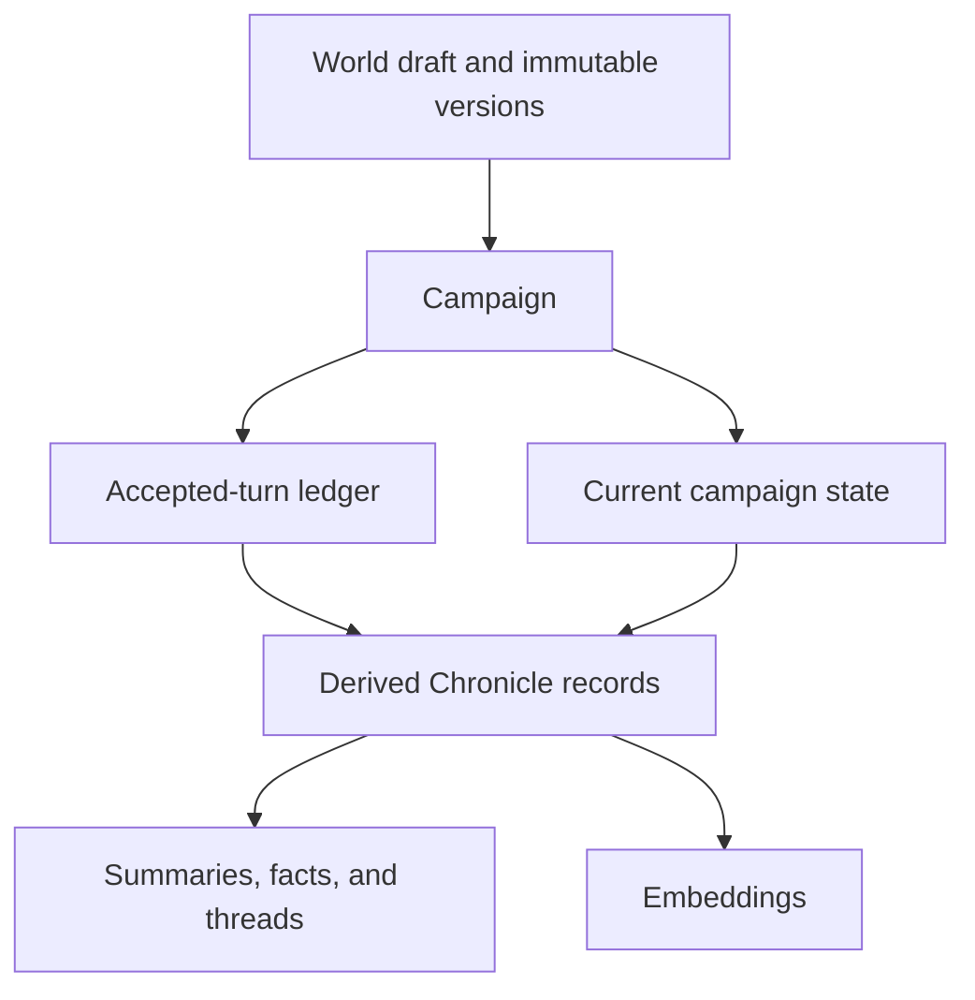

# Authoritative state

Nexus distinguishes recovery truth from data that can be rebuilt.

## Authoritative

- Internal users and ownership
- Mutable world drafts and immutable world versions
- Campaign identity, pinned version, and selected character snapshot
- Accepted-turn ledger
- Current campaign state
- Durable job and audit metadata required for idempotency and recovery

## Derived

- Chronicle narration memories
- Living summaries and checkpoints
- Extracted canonical facts and open threads
- Full-text search vectors and semantic embeddings

Derived data can be regenerated only from the correct user, world-version, and campaign scope. Rebuildability does not permit cross-campaign retrieval.

Related decisions: [ADR 0001](../architecture/0001-postgresql-chronicle.md), [ADR 0006](../architecture/0006-campaign-scoped-semantic-chronicle.md), and [ADR 0010](../architecture/0010-dynamic-chronicle-context.md).
