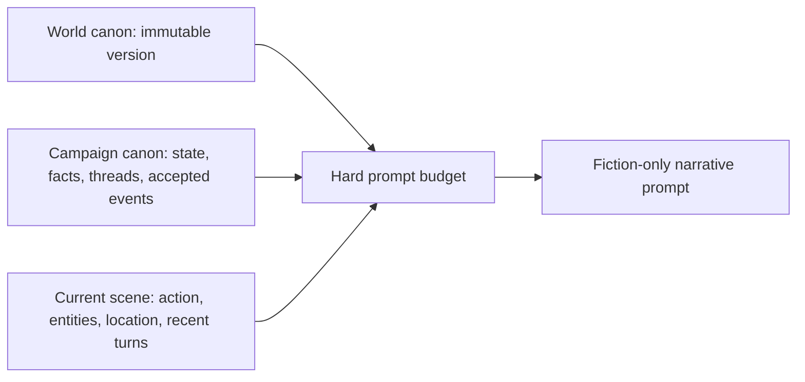

# Context construction

Every story request bootstraps from three controlled scopes.

The budget reserves space for provider output and protocol overhead before selecting memories. High-priority authoritative context is retained while lower-priority derived material is compressed or omitted.

Compression modes range from complete selected memories to summary-plus-recent context. Automatic mode chooses the least compressed form that fits.

Retrieval can combine semantic similarity, entity and keyword matches, recency, chronology, and open-thread relevance. Selected memory identifiers and hashes are recorded for diagnostics without logging private prompts.

Provider `previous_response_id` values are immediate incomplete-response recovery optimizations. They are scoped by campaign, world version, endpoint, model, prompt protocol, and context configuration and are never authoritative cross-turn memory.
