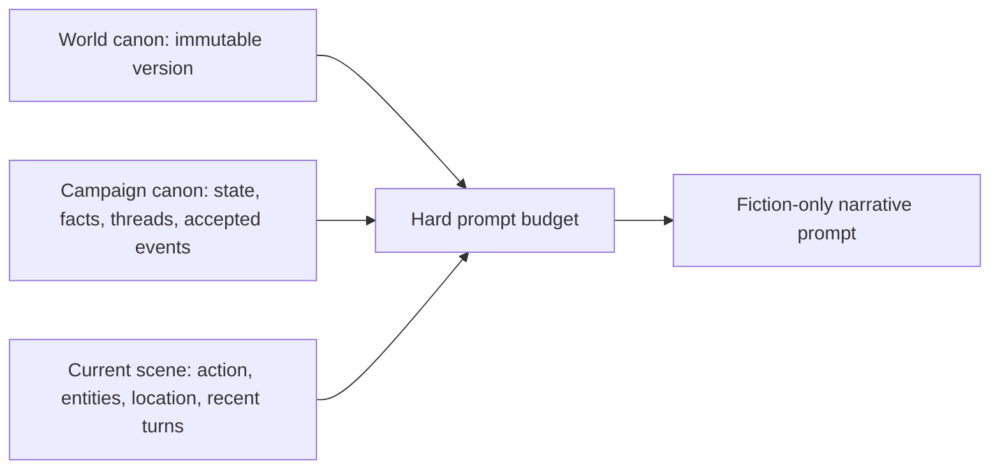

# Context construction

Every story request bootstraps from three controlled scopes.

```mermaid
flowchart LR
  World["World canon: immutable version"] --> Budget["Hard prompt budget"]
  Campaign["Campaign canon: state, facts, threads, accepted events"] --> Budget
  Scene["Current scene: action, entities, location, recent turns"] --> Budget
  Budget --> Prompt["Fiction-only narrative prompt"]
```

Each campaign owns its Story context budget. Campaign Management controls use 32K by default and offer fixed targets through 1M; the server, rather than either Story Player, resolves that setting when creating a request and snapshots it with the durable generation job. API callers may use any validated value in the existing contract range only where the campaign configuration allows it.

The requested budget is distinct from the provider/model context window. Before retrieval, the runtime takes the smaller applicable window, reserves provider output and protocol overhead, then derives the effective Chronicle budget. High-priority authoritative context is retained while lower-priority derived material is compressed or omitted. If fixed authority cannot fit, generation reports the existing context-budget error rather than silently dropping it.

The current turn is typed before prompt construction. Only the active Action or Scene direction contract is included near the submitted text: Action asks the model to resolve and narrate intent, while Scene direction requires the stated current-turn beats before aftermath. Auto never appears in the story prompt because it resolves before the generation job is created.

Compression modes range from complete selected memories to summary-plus-recent context. Automatic mode chooses the least compressed form that fits.

No provider-payload context knob is required. Infinite Quest assembles and trims the fiction-only prompt before dispatching it to the text provider.

Retrieval can combine semantic similarity, entity and keyword matches, recency, chronology, and open-thread relevance. Selected memory identifiers and hashes are recorded for diagnostics without logging private prompts.

Provider `previous_response_id` values are immediate incomplete-response recovery optimizations. They are scoped by campaign, world version, endpoint, model, prompt protocol, and context configuration and are never authoritative cross-turn memory.
