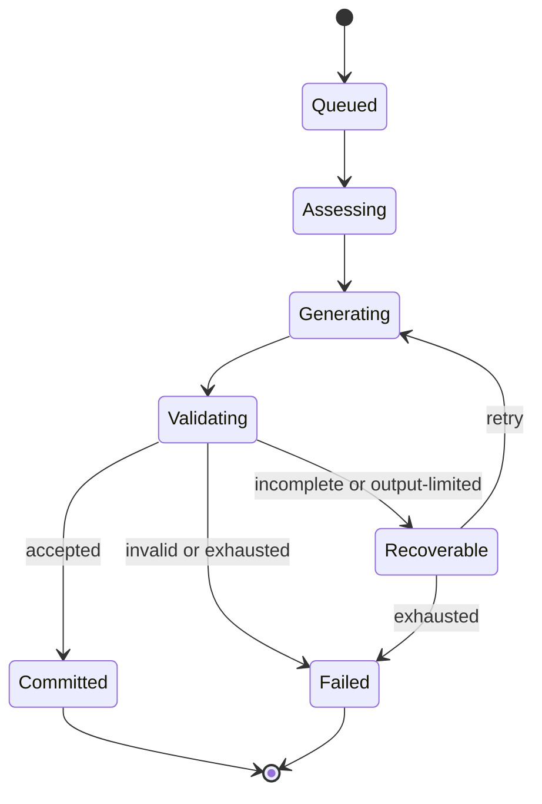

# Generation integrity

The job state is durable even when the browser, API replica, worker, or provider connection changes.

Friendly player stages such as **Reading state**, **Resolving action**, **Writing scene**, and **Saving turn** summarize this internal lifecycle.

Acceptance requires typed parsing, schema validation, mechanic-leak checks, campaign/version compatibility, and a transactional commit. The accepted turn, state transition, and Chronicle update succeed together or not at all.

Recovery reuses persisted private assessment and random results. It does not reroll because a provider response was truncated. Expired worker leases allow safe reclaim after a crash.

The optional illustration job starts only after story commitment and is outside this acceptance transaction.
