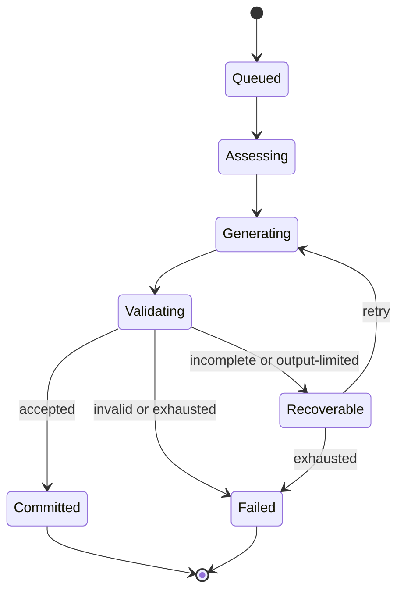

# Generation integrity

The job state is durable even when the browser, API replica, worker, or provider connection changes.

```mermaid
stateDiagram-v2
  [*] --> Queued
  Queued --> Assessing
  Assessing --> Generating
  Generating --> Validating
  Validating --> Committed: accepted
  Validating --> Recoverable: incomplete or output-limited
  Recoverable --> Generating: retry
  Validating --> Failed: invalid or exhausted
  Recoverable --> Failed: exhausted
  Committed --> [*]
  Failed --> [*]
```

Friendly player stages such as **Reading state**, **Resolving action**, **Writing scene**, and **Saving turn** summarize this internal lifecycle.

Acceptance requires typed parsing, schema validation, mechanic-leak checks, campaign/version compatibility, and a transactional commit. The accepted turn, state transition, and Chronicle update succeed together or not at all.

Recovery reuses persisted private assessment and random results. It does not reroll because a provider response was truncated. Expired worker leases allow safe reclaim after a crash.

Story Direction jobs also persist a generation-policy snapshot. The worker
uses that snapshot on retry or lease reclaim, so it cannot switch to the
campaign's current setting after queueing. The Story-only policy preserves
authoritative context and validation while skipping RPG assessment, event
evaluation, and independent semantic scene coverage. If only its required
choices are invalid, one bounded choice-only repair may run without changing
otherwise accepted narration or authority. See [Story-only campaign
policy](../architecture/story-only-campaign-policy.md).

Illustration success is independent of story acceptance. Accepted-turn jobs start after commitment, but the streaming implementation can create provisional illustration work before final-turn validation and promote it after commitment. See [Illustration pipeline](./illustration-pipeline.md#provisional-streaming-path-and-open-contract-conflict) for the current behavior and unresolved validation-boundary conflict.
