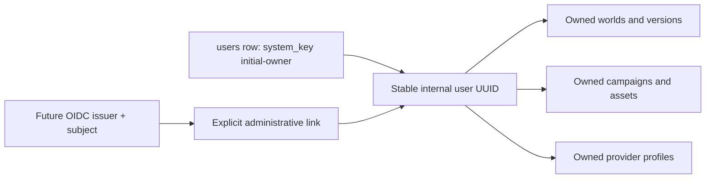

# Identity and ownership

Application identity is a stable, non-semantic internal UUID. Email, display name, username, and external provider subject are not primary keys.

The first migration creates `initial-owner` idempotently and the database retains its UUID. Until authentication exists, every API and worker request resolves that record on the server.

Browser-supplied user identifiers, portable export provenance, and a first login do not establish ownership. Future OIDC must explicitly attach the intended `(issuer, subject)` to the existing internal user without rewriting owned data.

Child records remain protected through campaign/world relationships and database constraints. Retrieval must combine user, world-version, and campaign scope so data cannot cross ownership boundaries accidentally.
