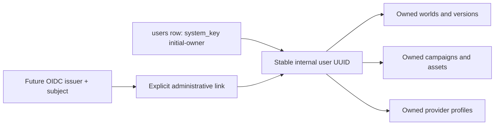

# Identity and ownership

Application identity is a stable, non-semantic internal UUID. Email, display name, username, and external provider subject are not primary keys.

```mermaid
flowchart LR
  Initial["users row: system_key initial-owner"] --> UUID["Stable internal user UUID"]
  UUID --> Worlds["Owned worlds and versions"]
  UUID --> Campaigns["Owned campaigns and assets"]
  UUID --> Profiles["Owned provider profiles"]
  Future["Future OIDC issuer + subject"] --> Link["Explicit administrative link"]
  Link --> UUID
```

Preserve the idempotent `initial-owner` bootstrap in [the initial migration](https://github.com/cmacnichol/infinite-quest-nexus/blob/main/database/migrations/0001_initial_nexus.sql) and the database-retained UUID. Introduce schema changes through new migrations rather than rewriting applied migration history. Until authentication exists, every API and worker request resolves that record on the server.

Browser-supplied user identifiers, portable export provenance, and a first login do not establish ownership. Future OIDC must explicitly attach the intended `(issuer, subject)` to the existing internal user without rewriting owned data.

Child records remain protected through campaign/world relationships and database constraints. Retrieval must combine user, world-version, and campaign scope so data cannot cross ownership boundaries accidentally.

## Ownership and imports

User-owned root records require non-null `owner_user_id`, including worlds, campaigns, assets, provider profiles, imports, and world versions where ownership is materialized. Jobs, memories, and model chains must carry or reliably derive the same owner scope.

Before authentication, created, generated, and imported content belongs to the server-resolved initial user. After authentication is introduced, imports belong to the authenticated user unless an administrator explicitly migrates ownership. Source-system user identifiers remain provenance, not destination authorization.

## Deferred OIDC design

Interactive login and OIDC are deferred. This is a design constraint for future implementation, not a claim that external identity tables or linking flows exist today.

Retain the `users` table's internal UUID, nullable unique `system_key`, `display_name`, `status`, and timestamps. Introduce `user_identities` through a new migration with:

- An internal UUID primary key.
- A `user_id` foreign key to `users.id`.
- Provider, issuer, and subject fields.
- A unique constraint on `(issuer, subject)`.

An explicit administrative claim or configured migration must attach the intended issuer and subject to the existing initial user. The first account to log in must not automatically receive legacy content. Linking preserves the internal UUID and all world, campaign, turn, and memory ownership.

Keep service and repository APIs user-scoped. Follow the [identity test matrix](../workflows/testing.md) when changing these boundaries and the [initial-user deployment guidance](../installation/initial-user.md) when configuring an installation.
