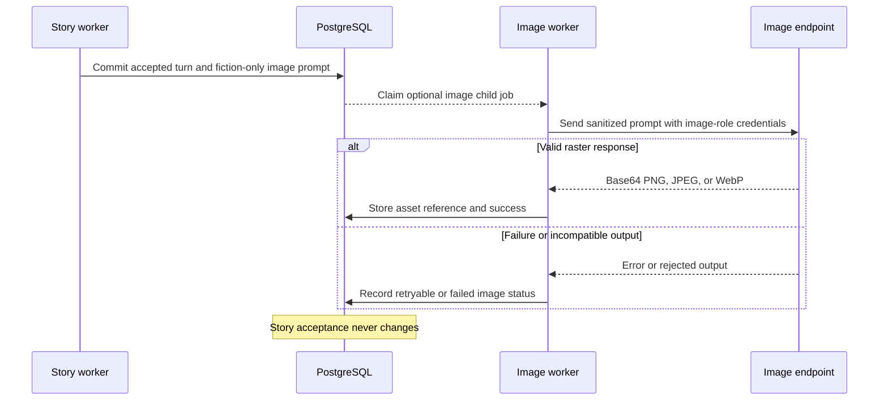

# Illustration pipeline

Illustrations are optional post-acceptance work with an independent provider boundary.

The image role has its own endpoint, key, model inventory, defaults, health, attempts, and campaign settings. It does not inherit the story text profile.

Only validated fiction and a fiction-only prompt cross the boundary. Rolls, private reasoning, hidden trackers, raw responses, rejected narration, and provider credentials do not.

Generated files are content-addressed and independently retryable. Nexus accepts base64 PNG, JPEG, or WebP and rejects untrusted URL or SVG output for this pipeline.

Related decision: [ADR 0008](../architecture/0008-independent-illustration-pipeline.md).
