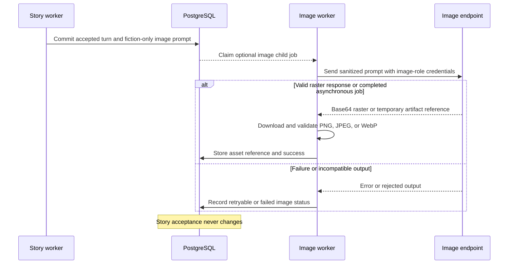

# Illustration pipeline

Illustrations are optional post-acceptance work with an independent provider boundary.

The image role has its own endpoint, key, model inventory, defaults, health, attempts, and campaign settings. It does not inherit the story text profile.

World-cover generation uses the same durable worker path with a different target: an editable world rather than an accepted turn. It always resolves the default image provider and model, stores the completed asset on the world, and never creates a campaign or changes campaign cost totals.

Only validated fiction and a fiction-only prompt cross the boundary. Rolls, private reasoning, hidden trackers, raw responses, rejected narration, and provider credentials do not.

Generated files are content-addressed and independently retryable. Sogni remote job IDs, generation revisions, deadlines, and polling state are durable so another worker can resume safely without intentionally duplicating an accepted remote workflow. Provider artifacts are downloaded under bounded network and size controls, then validated by raster signature as PNG, JPEG, or WebP; SVG and payloads masquerading as images are rejected.

Related decision: [ADR 0008](../architecture/0008-independent-illustration-pipeline.md).
