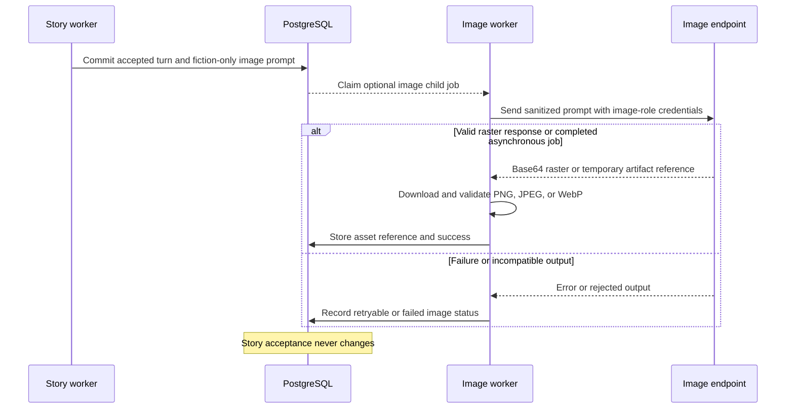

# Illustration pipeline

Illustrations use an independent provider boundary. The implementation supports both accepted-turn jobs and provisional segmented jobs while narration is streaming. Image failure does not determine whether a story turn is accepted.

## Accepted-turn path

The following diagram describes jobs created from an accepted turn.

```mermaid
sequenceDiagram
  participant W as Story worker
  participant DB as PostgreSQL
  participant I as Image worker
  participant P as Image endpoint
  W->>DB: Commit accepted turn and fiction-only image prompt
  DB-->>I: Claim optional image child job
  I->>P: Send sanitized prompt with image-role credentials
  alt Valid raster response or completed asynchronous job
    P-->>I: Base64 raster or temporary artifact reference
    I->>I: Download and validate PNG, JPEG, or WebP
    I->>DB: Store asset reference and success
  else Failure or incompatible output
    P-->>I: Error or rejected output
    I->>DB: Record retryable or failed image status
  end
  Note over DB: Story acceptance never changes
```

The image role has its own endpoint, key, model inventory, defaults, health, attempts, and campaign settings. It does not inherit the story text profile.

World-cover generation uses the same durable worker path with a different target: an editable world rather than an accepted turn. It always resolves the default image provider and model, stores the completed asset on the world, and never creates a campaign or changes campaign cost totals.

The required boundary is fiction-only input: rolls, private reasoning, hidden trackers, raw responses, and text-provider credentials must not enter the image prompt. The provisional path below begins before final-turn validation, so segment sanitization must not be described as proof of accepted narration.

Generated files are content-addressed and independently retryable. Sogni remote job IDs, generation revisions, deadlines, and polling state are durable so another worker can resume safely without intentionally duplicating an accepted remote workflow. Provider artifacts are downloaded under bounded network and size controls, then validated by raster signature as PNG, JPEG, or WebP; SVG and payloads masquerading as images are rejected.

## Provisional streaming path and open contract conflict

When streaming segmentation is active, the Story worker extracts partial narration, strips mechanics from the image-prompt excerpt, and creates a provisional illustration set and segments scoped to the generation job. Direct mode queues an image job immediately; AI-refined mode queues prompt refinement. These jobs can run before the final story turn is validated and committed.

On acceptance, promotion attaches the provisional set, segments, and jobs to the accepted turn. On terminal generation failure, the worker attempts to orphan the provisional set; cleanup failure does not replace the generation result. This lifecycle cannot undo a provider request already submitted.

[ADR 0025](../architecture/0025-streaming-illustration-pipeline.md) records this implementation. Its pre-commit dispatch conflicts with the repository requirement to dispatch illustrations only after narration and the fiction-only prompt pass validation. That contract remains unresolved: this description records current behavior, does not authorize weakening validation, and does not certify that provisional excerpts will pass final-turn validation.

Related decisions: [ADR 0008](../architecture/0008-independent-illustration-pipeline.md) and [ADR 0025](../architecture/0025-streaming-illustration-pipeline.md).
