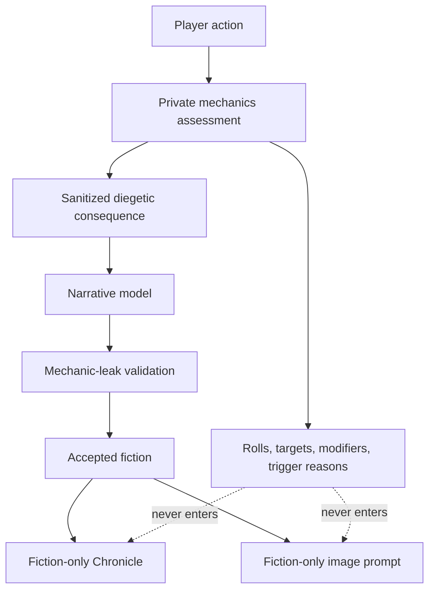

# Mechanics and fiction separation

Mechanics and narration travel through separate typed paths.

Private data includes dice, checks, statistics, scores, targets, modifiers, trigger counters and reasons, scratchpads, parser diagnostics, rejected output, and raw reasoning. The narrative model receives only the fictional consequence required to write the scene.

Validation scans all narrative fields for mechanic leakage before display or persistence. Retrying narration reuses the durable private result rather than changing the resolved event.

Related decision: [ADR 0005](../architecture/0005-typed-private-story-orchestration.md).
