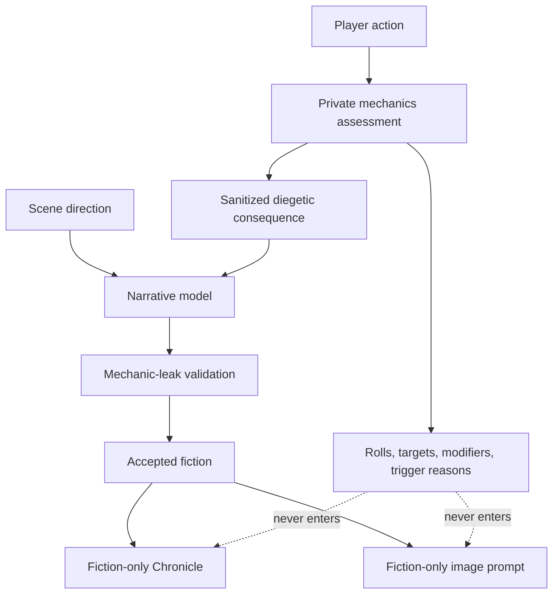

# Mechanics and fiction separation

Mechanics and narration travel through separate typed paths.

Private data includes dice, checks, statistics, scores, targets, modifiers, trigger counters and reasons, scratchpads, parser diagnostics, rejected output, and raw reasoning. The narrative model receives only the fictional consequence required to write the scene.

Validation scans all narrative fields for mechanic leakage before display or persistence. Retrying narration reuses the durable private result rather than changing the resolved event.

Scene direction is not a hidden mechanics result. It is typed authorial input whose stated events are required fiction for the current turn, so normal action assessment is skipped. It still passes instruction-leak and canon validation; forbidden mechanics or engine directives cause an actionable error rather than being silently removed. Auto classification receives no private mechanics or Chronicle context.

Related decisions: [ADR 0005](../architecture/0005-typed-private-story-orchestration.md) and [ADR 0021](../architecture/0021-turn-input-intent-classification.md).
