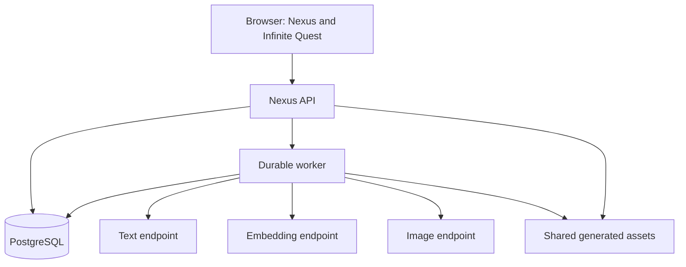

# Platform overview

Infinite Quest Nexus separates browser presentation, authoritative state, durable work, and external inference.

The browser communicates only with the Nexus API for authoritative operations. PostgreSQL owns identities, worlds, immutable versions, campaigns, turns, state, and durable jobs. Workers claim jobs through the database and call providers.

Text, embeddings, and images are capability roles rather than one assumed endpoint. The same provider brand can offer more than one role, but Nexus still stores independent profiles and credentials.

Compose combines API and worker behavior in `infinitequest-app`. Swarm runs independently scalable API and worker services against the same contracts.

Related decisions: [ADR 0001](../architecture/0001-postgresql-chronicle.md), [ADR 0002](../architecture/0002-postgresql-worker-jobs.md), and [ADR 0008](../architecture/0008-independent-illustration-pipeline.md).
