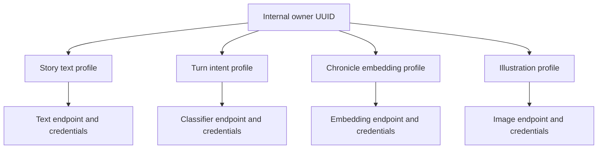

# Provider model

Nexus models external inference as independent role-specific profiles.

Each profile owns:

- Provider adapter/type
- Base URL
- Encrypted credential
- Enabled/default state for its role
- Discovered and selected model
- Capability settings and request timeout
- Health and safe diagnostics

One vendor may serve multiple roles, but sharing a hostname does not authorize Nexus to copy credentials or infer model compatibility. Turn Intent is optional and system-wide: an explicitly default profile classifies Auto input, otherwise the campaign Story text profile does so. Intent never generates story text.

Transport diagnostics are bounded and sanitized. They can identify phase, endpoint origin, model, timeout, status class, correlation, and latency without recording prompt bodies or credentials.

Related decisions: [ADR 0008](../architecture/0008-independent-illustration-pipeline.md) and [ADR 0012](../architecture/0012-provider-transport-deadlines.md).
