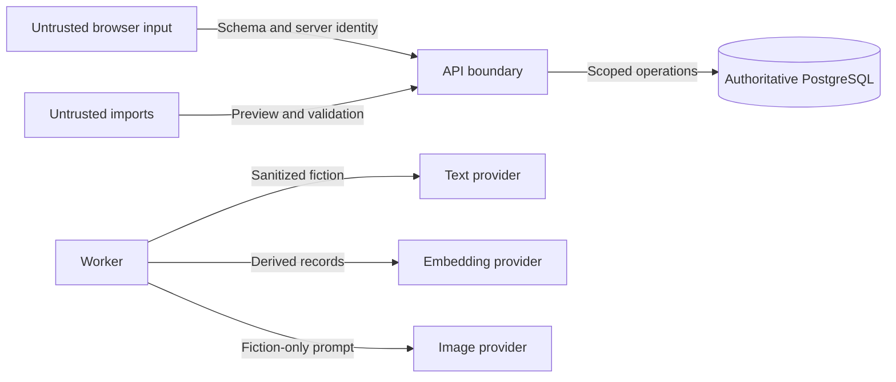

# Security boundaries

Nexus protects authoritative state through validation, ownership scope, independent secrets, and durable auditability, but its current network perimeter assumes trusted access.

## Current perimeter

Interactive login and OIDC are deferred. CORS and browser headers are not authorization. Operators must restrict the service, database, and provider endpoints to the intended trusted network and add TLS/reverse-proxy controls for remote access.

## Validation boundaries

- Browser/API payloads use shared schemas.
- Database-derived records are checked before domain use.
- Provider responses are parsed, typed, and leak-checked before acceptance.
- Imported and rendered content is untrusted.
- LLM or MCP output cannot write authoritative state without an application operation and validation.

## Secret boundaries

Database, encryption, text, embedding, and image secrets remain separate. Provider credentials are encrypted at rest, never returned to the browser, and excluded from exports, logs, prompts, and screenshots.

## Scope boundaries

User ownership, immutable world-version selection, and `campaign_id` constrain every applicable operation and retrieval. API replicas are stateless, but correctness does not depend on client honesty or local process memory.
