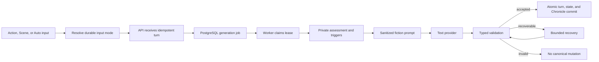

# Story Engine

Story Engine coordinates mechanics assessment, prompt construction, provider calls, validation, recovery, and memory indexing as durable work.

Workers claim jobs with PostgreSQL row locks and leases. Uniqueness constraints and idempotency keys prevent duplicate next turns across API or worker replicas.

Every turn starts with an authoritative database snapshot. A model switch changes the request destination but not the campaign facts supplied to it.

Action input enters private mechanics assessment as player intent. Scene direction enters the story prompt as required current-turn facts and bypasses the normal action roll. Auto is resolved before the generation job begins and is never a third narrative prompt mode. Retries retain that durable resolution.

The optional Intent provider only performs the narrow Auto classification. Story prompt construction, narration, validation, and any scene-coverage rewrite continue to use the campaign Story text provider.

Provider-reported cost is recorded when supplied and is never inferred. Campaign totals can exceed visible turn totals because failed, rewound, or unattributed calls remain part of the operational ledger.

Related decisions: [ADR 0002](../architecture/0002-postgresql-worker-jobs.md), [ADR 0003](../architecture/0003-worker-owned-story-engine.md), [ADR 0005](../architecture/0005-typed-private-story-orchestration.md), [ADR 0011](../architecture/0011-provider-reported-campaign-costs.md), and [ADR 0021](../architecture/0021-turn-input-intent-classification.md).
