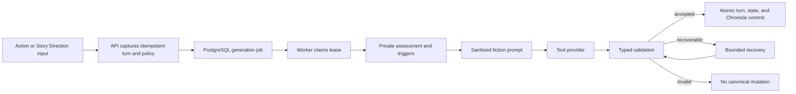

# Story Engine

Story Engine coordinates mechanics assessment, prompt construction, provider calls, validation, recovery, and memory indexing as durable work.

```mermaid
flowchart LR
  Input["Action or Story Direction input"] --> API["API captures idempotent turn and policy"]
  API --> Job["PostgreSQL generation job"]
  Job --> Worker["Worker claims lease"]
  Worker --> Assess["Private assessment and triggers"]
  Assess --> Prompt["Sanitized fiction prompt"]
  Prompt --> Provider["Text provider"]
  Provider --> Validate["Typed validation"]
  Validate -->|"accepted"| Commit["Atomic turn, state, and Chronicle commit"]
  Validate -->|"recoverable"| Recover["Bounded recovery"]
  Validate -->|"invalid"| Failed["No canonical mutation"]
  Recover --> Validate
```

Workers claim jobs with PostgreSQL row locks and leases. Uniqueness constraints and idempotency keys prevent duplicate next turns across API or worker replicas.

Every turn starts with an authoritative database snapshot. A model switch changes the request destination but not the campaign facts supplied to it.

Action input enters private mechanics assessment as player intent. An explicit
Story Direction in a flexible Action campaign enters the scene path; a Story
Direction campaign queues the story-only policy directly. Story-only work
skips RPG assessment, event evaluation, and independent semantic scene coverage
while retaining world canon, corrected continuity, campaign state, Chronicle
retrieval, budgets, and validation. It follows the direction subject to that
authority; it does not promise unspecified outcomes. Auto classification and
the Intent provider role are retired.

Provider-reported cost is recorded when supplied and is never inferred. Campaign totals can exceed visible turn totals because failed, rewound, or unattributed calls remain part of the operational ledger.

Related decisions: [ADR 0002](../architecture/0002-postgresql-worker-jobs.md), [ADR 0003](../architecture/0003-worker-owned-story-engine.md), [ADR 0005](../architecture/0005-typed-private-story-orchestration.md), [ADR 0011](../architecture/0011-provider-reported-campaign-costs.md), and [Story-only campaign policy](../architecture/story-only-campaign-policy.md).
