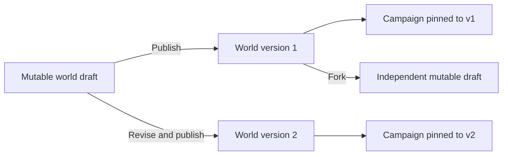

# Worlds and versions

A world is a reusable authored project. It has one mutable draft and a history of immutable published snapshots.

Publication freezes lore, rules, entities, relationships, triggers, defaults, and playable characters. Editing the draft or publishing version 2 cannot mutate a campaign pinned to version 1.

A campaign can move only through an explicit reviewed same-world migration. Forking copies a selected version into a new independently owned draft. An unused version can be deleted only when no current or historical campaign dependency exists; its version number is never reused.

Related decisions: [ADR 0007](../architecture/0007-world-library-versioning.md), [ADR 0015](../architecture/0015-deletable-unused-world-versions.md), and [ADR 0016](../architecture/0016-reviewed-character-authoring.md).
