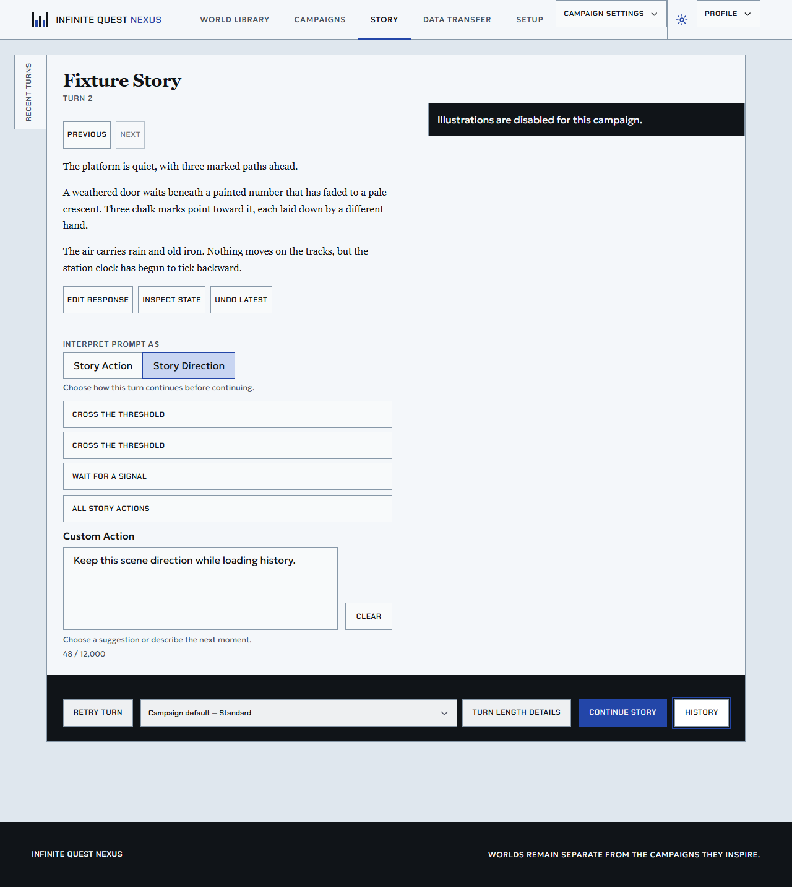

# Fresh-review corrections

These corrections address the three P2 findings from the review of
`977d8a53..5f87483c`. They are limited to the existing story-only worktree.

## Corrections

- Preserve an explicit Story Direction selection in an Action campaign when
  history or runtime-state data refreshes. A real campaign policy change still
  normalizes the selection without clearing the draft.
- Classify recovered Story-only output for choice defects even when the general
  story parser rejects it. Valid non-choice fields and producing-request
  provenance remain in the pending checkpoint; explicit retry repairs only
  choices. Missing choices, wrong counts, empty suggestions, choice mechanics,
  and output-limited choice defects are covered.
- Accept valid explicit Action input for Story Direction append and replacement
  requests, then persist Scene input under the authoritative campaign policy.
  Removed classification input and mismatched explicit modes remain rejected.

## Test-first evidence

The new UI model/page regressions failed before the fix. Five added recovered
choice cases failed because no pending checkpoint existed. Explicit Action
append and replacement cases failed with the former scene-only rejection.

After the fixes:

| Check | Result |
| --- | --- |
| Generation command repository and choice-repair PostgreSQL suites | 55 passed |
| Story-only generation and execution repository PostgreSQL suites | 41 passed |
| Executor, API error mapping, Story-only parsing and prompt unit suites | 97 passed |
| New UI model and mounted page unit suites | 85 passed |
| Repository/type/client checks | Passed |
| Application build | Passed; existing font-resolution and large-chunk advisories |
| Web Awesome Chromium history regression | 1 passed; older history loaded, selection and draft retained |

PostgreSQL tests used the dedicated local test database. Providers were
synthetic; these results do not evaluate live-model quality. Independent
reviewers accepted the backend and UI fixes with no remaining findings.

## Rendered interaction evidence

The browser regression uses the local Web Awesome fixture with synthetic API
responses and real rendered components. It selects Story Direction, types a
draft, loads the previously unloaded first turn through History, closes the
dialog, and checks the selection and draft again. An initial sandbox Chromium
launch failure was resolved by rerunning with process permission; the test then
passed. Native uses the same corrected model and passed the mounted-page unit
regression; its browser check was not rerun during this correction.

No live provider, production deployment, main-branch integration, or publication
was performed.
