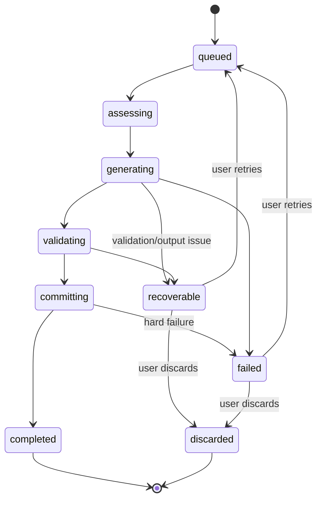

# Interaction Flows — Infinite Quest Nexus

The generic audit template lists flows assuming a document-review product
(contradiction inspection, cross-reference validation, citation review).
Per `PRODUCT_UX.md` §Adapting the review paradigm, several of those have no
analog in Infinite Quest Nexus and are marked **Not applicable** below
rather than forced. All flows use the screen IDs from `SCREEN_INVENTORY.md`
and endpoints from `API_UI_CONTRACTS.md`.

Generation is the first job family moved behind the headless client-core
workflow and client-web browser adapters. The generic watcher for image,
Chronicle, world-cover, and import jobs remains deferred.

## Shared reference: generation-job status flow

Every "AI analysis"-shaped flow below (turn generation, illustration,
Chronicle reindex, embedding reindex) is a variant of this same state
machine:

(Image and Chronicle jobs use a narrower version of this same shape — see
`API_UI_CONTRACTS.md` for their exact status enums.)

---

## Flow 1 — Select or add a world (template: "select or add a document")

- **Preconditions:** none (works on an empty catalog).
- **Main path:** NEX-WORLDS → search/browse → select existing world → NEX-WORLD-DETAIL. *Or:* NEX-WORLDS → "Create world" → fill overview fields (optionally AI-generate a preview) → save as draft → NEX-WORLD-DETAIL.
- **Alternate paths:** Import an existing world (NEX-IMPORTS, JSON) or convert an Infinite Worlds legacy document (NEX-IMPORTS, AI-assisted).
- **Error paths:** Create/import validation failure (Zod `issues` in error envelope) shown inline, not as a raw dump.
- **Completion state:** A draft world exists and is open in NEX-WORLD-DETAIL.
- **APIs:** `GET /worlds`, `POST /worlds`, `POST /worlds/generate-preview`, `POST /imports/world(/preview)`, `POST /imports/infinite-worlds(/preview)`.
- **Screens:** NEX-WORLDS, NEX-WORLD-DETAIL, NEX-IMPORTS.
- **Current implementation status:** Implemented and wired.

## Flow 2 — Start AI-assisted generation (template: "start AI analysis")

- **Preconditions:** Campaign exists, pinned to a published world version; at least one enabled text provider configured (default or explicit).
- **Main path:** STORY-PLAYER → choose input mode (Action/Scene/Auto) → submit → `POST /campaigns/:id/generations` → `GenerationWorkflow` watches through the client-web SSE/poll source → typed status and `GenerationEvent.narration` updates render → `completed` → validated narration/choices replace the preview atomically and the turn is appended to history.
- **Alternate paths:** **Retry-latest** ("replace" variant) — same flow via `POST .../generations/retry-latest`, must be visually distinguished per `PRODUCT_UX.md` Principle 1 and `CURRENT_UI_AUDIT.md` UI-006 (staged replacement of already-accepted content, ADR 0017).
- **Error paths:** `recoverable` → present retry/discard with plain-language reason (see Flow 8). `failed` → same, error-styled. A structured active-job 409 attaches/resumes `details.pendingGeneration`, shows exactly "a turn is already generating", and does not submit a second idempotency key. If a completed result fetch is temporarily unavailable, keep the accepted preview visible and retry `GenerationRun.fetchResult()` only.
- **Completion state:** New turn appended to the accepted-turn ledger; campaign state updated transactionally.
- **APIs:** `POST /generations`(`/retry-latest`), `GET .../generation-jobs/:id`(`/stream`,`/result`).
- **Screens:** STORY-PLAYER.
- **Current implementation status:** Implemented and wired. Q1 is resolved: progressive narration is visible through the workflow's typed narration event, never by reading raw transport fields in the app. Q4 remains preserved: replacement jobs are visually distinct and state that the accepted turn remains until validation.

## Flow 3 — Analyze/generate for a selected scope (template: "analyze a selection")

Closest analog: **segmented illustration generation for one turn/segment**,
or **turn-input classification** for Auto mode (a narrow, selection-scoped
AI call distinct from full turn generation).

- **Preconditions:** An accepted turn exists (for illustration) or input text is entered (for classification).
- **Main path (illustration):** STORY-PLAYER illustration panel → select a segment → regenerate → `POST /illustration-segments/:id/images` → poll `GET /image-jobs/:jobId` → result replaces/adds a variant (max 2).
- **Main path (classification):** STORY-PLAYER input bar, Auto mode → `POST /turn-input/classify` → resolved mode (Action/Scene) shown before generation proceeds.
- **Error paths:** Image job `recoverable`/`failed` → retry action (`POST /image-jobs/:jobId/retry`); today, polling failures are silently swallowed (`CURRENT_UI_AUDIT.md` UI-003) — the replacement flow must instead surface a visible degraded-polling state.
- **Completion state:** New/updated illustration variant, or a resolved turn-input mode ready for full generation.
- **APIs:** `POST /illustration-segments/:segmentId/images`, `GET/POST /image-jobs/:jobId(/retry)`, `POST /turn-input/classify`.
- **Screens:** STORY-PLAYER.
- **Current implementation status:** Implemented and wired (illustration); Implemented and wired (classification).

## Flow 4 — Analyze the complete scope (template: "analyze an entire document")

Closest analog: **Chronicle reindex** (rebuilds derived memory across the
entire campaign's accepted-turn history) or **illustration backfill**
(generates missing illustrations across the whole campaign).

- **Preconditions:** Campaign has accepted turns.
- **Main path (Chronicle):** CHRONICLE-HEALTH → "Reindex" → `POST /memory/reindex` → poll `GET /jobs/:jobId` → `completed`.
- **Main path (illustration backfill):** NEX-CAMPAIGN-DETAIL → "Backfill illustrations" → preview (`POST .../illustration-backfill/preview`, states how many turns/segments affected) → confirm → `POST .../illustration-backfill` → poll.
- **Error paths:** Reindex `failed` → retry action, no partial-success ambiguity per capabilities.md ("durable, replica-safe rebuild jobs"). Backfill `partial` status → must be shown distinctly from `completed` (some turns succeeded, some didn't).
- **Completion state:** Chronicle metrics refresh; or all previously-missing illustrations present (or backfill marked `partial`/`failed` with detail).
- **APIs:** `POST /memory/reindex`, `GET /jobs/:jobId`; `POST /illustration-backfill(/preview)`.
- **Screens:** CHRONICLE-HEALTH, NEX-CAMPAIGN-DETAIL.
- **Current implementation status:** Implemented and wired.

## Flow 5 — Analyze a proposed change (template: "analyze a proposed change")

Closest analog: **cross-world transfer preview** or **same-world version
migration** — both let the user see the effect of a proposed change to a
campaign's world pinning before committing.

- **Preconditions:** Campaign exists; a target world version (same world, newer; or a different world) exists.
- **Main path:** NEX-CAMPAIGN-DETAIL → "Migrate" or "Transfer to another world" → preview (`POST .../migrate-world` is direct/no preview endpoint; `POST .../transfer-world/preview` for cross-world) → review preview → confirm → commit.
- **Alternate paths:** Same-world migration has no separate preview endpoint in the API (`API_UI_CONTRACTS.md`) — the UI should still show a confirmation step stating what will and won't change (character snapshot preserved, ledger preserved, world content updated) even without a server-computed preview payload.
- **Error paths:** Migration blocked while a generation job is active — surfaced as a specific, explained block, not a generic error (`FEATURE_IMPLEMENTATION_MATRIX.md`).
- **Completion state:** Campaign now pinned to the new world version (migration) or a new, independent campaign exists (transfer) with the original preserved unchanged.
- **APIs:** `POST /campaigns/:id/migrate-world`, `POST .../transfer-world(/preview)`.
- **Screens:** NEX-CAMPAIGN-DETAIL.
- **Current implementation status:** Implemented and wired.

## Flow 6 — Track analysis (generation) progress

- **Preconditions:** A job is `queued` or later, not yet terminal.
- **Main path:** STORY-PLAYER observes the active `GenerationRun`; the client-web source opens SSE and the headless workflow emits validated status/narration events. On terminal status, the run transitions to result/recovery without an app-owned transport branch.
- **Alternate path:** SSE unsupported, authenticated with non-query headers, or lost → the client-web source degrades visibly and falls back to bounded polling of `GET /generation-jobs/:jobId`.
- **Error paths:** Stream/poll itself fails (network) → distinct "can't check progress" state, not silence (generalizes the fix for `CURRENT_UI_AUDIT.md` UI-003 to this flow too).
- **Completion state:** Terminal status reached and rendered.
- **APIs:** `GET .../generation-jobs/:jobId/stream`, `GET .../generation-jobs/:jobId`.
- **Screens:** STORY-PLAYER.
- **Current implementation status:** Implemented and wired; the former raw EventSource/poll/timeout monitor was deleted.

## Flow 7 — Review outcomes (template: "review findings")

Closest analog: reviewing the accepted-turn ledger / recent job outcomes for a campaign.

- **Preconditions:** Campaign has at least one turn or job.
- **Main path:** STORY-PLAYER turn-history drawer, or NEX-CAMPAIGN-DETAIL history tab → scroll/browse accepted turns, each showing action, narration excerpt, cost, illustration status.
- **Alternate paths:** Activity log (broader event stream, incl. non-turn events).
- **Error paths:** n/a (read-only browse).
- **Completion state:** User has located the turn/event they were looking for.
- **APIs:** `GET /campaigns/:id/turns`.
- **Screens:** STORY-PLAYER, NEX-CAMPAIGN-DETAIL.
- **Current implementation status:** Implemented and wired.

## Flow 8 — Recover from a failure (template: "recover from analysis failure")

- **Preconditions:** A job is `recoverable` or `failed`.
- **Main path:** Recovery panel shows plain-language reason (`errorMessage`) → user chooses **Retry** (`POST .../retry`) → job re-enters `queued`/`replacement_queued` → Flow 2/6 resume. Or user chooses **Discard** (`POST .../discard`) → job becomes `discarded`, no turn is created, accepted history is untouched.
- **Active-job cancel path:** User chooses **Cancel** → the active run sends `POST .../cancel` and the server job becomes `cancelled`. This durable action is distinct from abort/navigation, which only detaches the local watcher and leaves the server job running.
- **Alternate paths:** Same pattern for image jobs (`POST /image-jobs/:jobId/retry`) — no discard endpoint for image jobs was found; confirm whether "remove" (variant deletion) is the equivalent discard action (`OPEN_QUESTIONS.md`).
- **Error paths:** Retry/discard itself fails (rare) → standard error envelope handling.
- **Completion state:** Job is either back in progress (retry) or terminally discarded.
- **APIs:** `POST .../generation-jobs/:jobId/retry`, `POST .../cancel`, `POST .../discard`; `POST /image-jobs/:jobId/retry`.
- **Screens:** STORY-PLAYER.
- **Current implementation status:** Implemented and wired (generation jobs); Implemented and wired for retry, discard action unconfirmed for image jobs (`OPEN_QUESTIONS.md`).

## Flow 9 — Rerun analysis (template: "rerun analysis")

Covered by Flow 8 (retry) for job-level rerun, and by Flow 2's retry-latest
variant for "regenerate the last accepted turn." No separate "rerun" concept
exists beyond these two.

## Flow 10 — Export results (template: "export findings")

- **Preconditions:** World or campaign exists.
- **Main path:** NEX-WORLD-DETAIL/NEX-CAMPAIGN-DETAIL → "Export" → `GET .../export` → file download (world: JSON only; campaign: zip-with-assets or JSON).
- **Alternate paths:** none.
- **Error paths:** export failure → standard error envelope.
- **Completion state:** File downloaded.
- **APIs:** `GET /worlds/:id/export`, `GET /campaigns/:id/export`.
- **Screens:** NEX-WORLD-DETAIL, NEX-CAMPAIGN-DETAIL.
- **Current implementation status:** Implemented and wired; campaign export asset-collection bug fixed 2026-07-30 (`FEATURE_IMPLEMENTATION_MATRIX.md`).

## Flow 11 — Resume interrupted work

- **Preconditions:** User returns to a campaign (fresh page load, tab reopen) that had an in-flight generation job or an in-progress import.
- **Main path (campaign):** STORY-PLAYER boot → `GenerationWorkflow.resume()` checks `GET .../sync-status`; `pendingGeneration` from the server is authoritative and creates the run for that exact job. The local pending-submission record is only an idempotent replay hint when the server has no active snapshot.
- **Alternate path (Infinite Worlds import):** `GET /imports/progress?key=...` — **not durable** across an API restart (`CURRENT_UI_AUDIT.md` UI-004); the UI must disclose this rather than imply guaranteed resumability.
- **Error paths:** Sync-status shows no pending job but the user expected one (e.g., it completed/failed while away) → reconcile by also checking recent turn history / job history, not just assuming nothing happened.
- **Completion state:** UI state matches server state; no orphaned "still generating" UI after the job has actually finished.
- **APIs:** `GET /campaigns/:id/sync-status`, `GET /imports/progress`.
- **Screens:** STORY-PLAYER, NEX-IMPORTS.
- **Current implementation status:** Implemented and wired (campaign resume); Implemented but incomplete (import progress durability).

## Flow 12 — Record a reviewer decision (template: "record a reviewer decision")

The one true human-adjudication flow in this product: **ADR 0016 reviewed
character authoring.**

- **Preconditions:** User has triggered AI generation/organization of a character profile (world draft or campaign character).
- **Main path:** NEX-WORLD-DETAIL (Characters tab) → "Generate with AI" → `POST .../playable-characters/generate` (or `/organize`) → populated fields shown in a **review** state, not yet persisted → user edits/accepts → explicit "Save" → `PUT`/persisted.
- **Alternate paths:** Same pattern for campaign-level character-profile organize (`POST /campaigns/:id/character-profile/organize`).
- **Error paths:** Generation failure → retry the AI-assist step; user can always fall back to manual entry without AI assistance.
- **Completion state:** Character profile persisted only after explicit user save — never auto-persisted.
- **APIs:** `POST .../playable-characters/generate`, `.../organize`, `POST /campaigns/:id/character-profile/organize`, `PUT /campaigns/:id/character-profile`.
- **Screens:** NEX-WORLD-DETAIL, NEX-CAMPAIGN-DETAIL.
- **Current implementation status:** Implemented and wired — treat this as the reference pattern for "AI output requires human confirmation" (`PRODUCT_UX.md` §Reviewer-decision behavior).

## Flows not applicable to this product

Per the generic template, these have no analog and should not be built:

- **Inspect a contradiction** — no entity in this product is checked for
  logical contradiction against another. The nearest structural cousin is
  world-version delete-blocker inspection (the `blockers` field explaining
  *why* a delete is refused) — already covered under
  `API_UI_CONTRACTS.md` §Confirmed contract constraints; not a "contradiction"
  in the document-review sense.
- **Inspect an invalid cross-reference** — no cross-reference/citation
  model exists between entities in this product.
- **Compare related sections** — the closest partial analog (draft vs.
  published world content, or transfer/migration preview) is covered in
  Flow 5; there is no general "compare any two sections" feature and none
  should be invented.
- **Review source citations** — no citation model exists; the closest
  analog (cost-line-item and Chronicle-entry traceability) is covered under
  `PRODUCT_UX.md` §Citation-equivalent traceability, not a dedicated flow.
